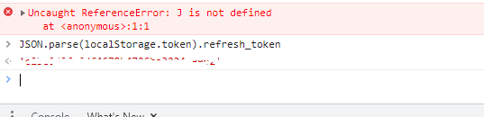
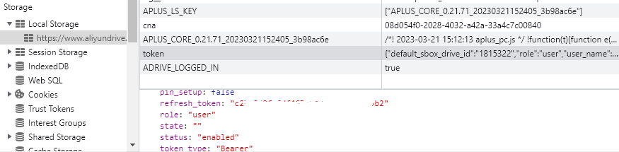
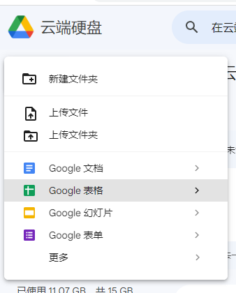
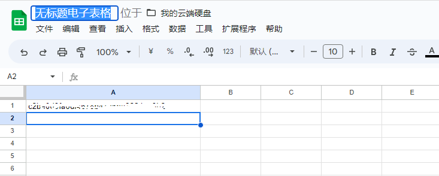
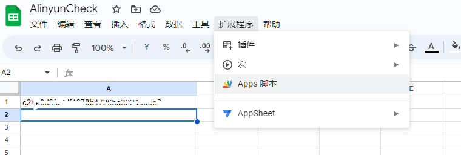
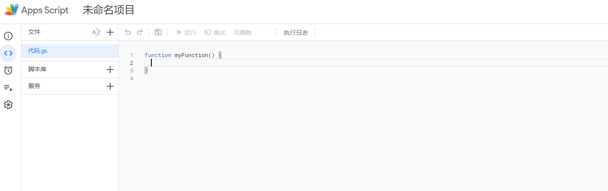
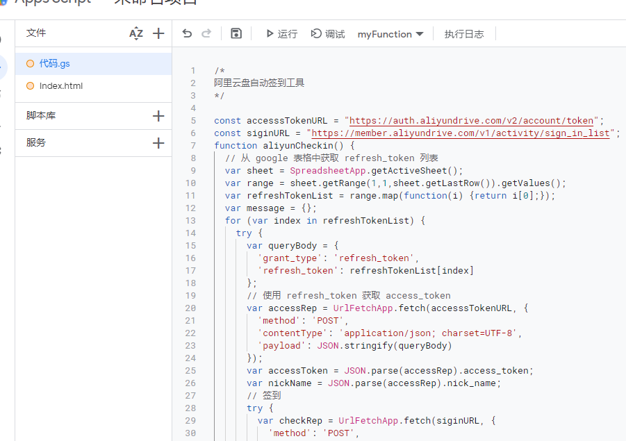
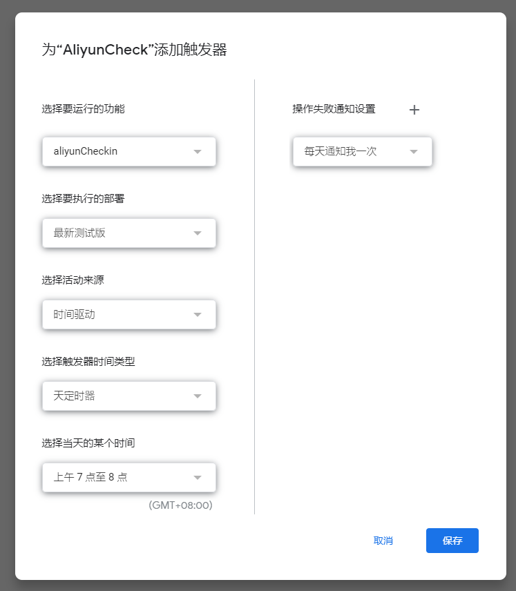

# aliyunAutoCheck

基于 **Google App Script** 的自动签到工具

## 使用

* **自动获取：** 登录[阿里云盘](https://www.aliyundrive.com/drive/)后，在浏览器开发者工具控制台粘贴 `JSON.parse(localStorage.token).refresh_token`
  
* **手动获取：** 登录[阿里云盘](https://www.aliyundrive.com/drive/)后，可以在开发者工具 ->
  Application -> Local Storage 中的 `token` 字段中找到，右击 refresh_token,选择 Copy value 即可
  
* 登录 [Google Drive](https://drive.google.com)，点击左上角新建 **Google表格**，重命名表格为合适的名字，在表格的 **A1** 位置写入上面获取到的 **refresh_token**，如果有多个，请依次向下填写
  
  
* 依次点击 **扩展程序 --> Apps脚本** 新建 **Google App Script** 脚本，重命名，并将 **.gs** 后缀文件中的内容复制进来，**Index.html** 文件中的内容也需要一并复制，当然文件名也需要相同，切记
  
  
  
* 保存之后就可以点击运行进行测试了，如果没问题的话你的邮箱就能收到签到信息了
  
* 如果需要每天自动签到的话，点击左侧的闹钟图标，添加触发器，按照需要配置即可，之后就能每天在设定时间自动签到了
  

## 申明

* 本项目仅做学习交流，请不要用于任何商业活动
* 如有侵权，请及时联系本人进行删除

## 鸣谢

#### 特别感谢以下作者及所开发的程序，本项目参考过以下几位开发者的代码及思想

* @mrabit: [mrabit/aliyundriveDailyCheck](https://github.com/mrabit/aliyundriveDailyCheck)
* @Anonym-w: [Anonym-w/autoSigninAliyun](https://github.com/Anonym-w/autoSigninAliyun)
